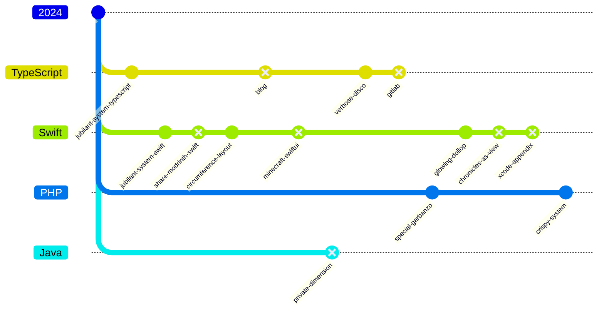
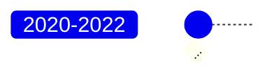
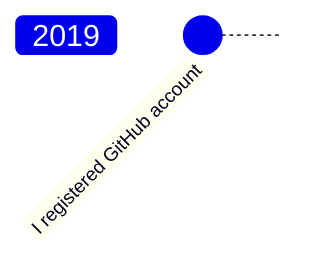

# @VladimirCreator’s development map

## Table of Contents


- [Description](#description)
- [2024](#2024)
- [2023](#2023)
- [2022](#2022)
- [2021](#2021)
- [2020](#2020)
- [2019](#2019)

## Description
Каждый кружок означает, что репозиторий исправно функционирует.

Каждый кружок с крестиком внутри означает, что репозиторий находится в процессе разработки.

> [!NOTE]
> Диаграммы не отражают всю полноту картины.

## 2024



## 2023

```mermaid
%%{init:{'gitGraph':{'mainBranchName':'2023'}}}%%

gitGraph
	commit id: " "
	branch JavaScript
	branch TypeScript
	branch Swift
	branch "C#"
	branch "C++"
	branch undefined

	checkout Swift
	commit id: "reminders-wed-19-apr-2023-swift" type: REVERSE

	checkout JavaScript
	commit id: "Packages"
checkout undefined
commit id: "_r__-for-a-comment"
commit id: "_r__-for-a-hotel"
commit id: "crud-for-a-x"
commit id: "cru_-for-an-application"
commit id: "curriculum-vitae"
commit id: "Documentaion"
commit id: "exam-for-december-2022"
commit id: "just-a-card"
commit id: "just-a-form"
commit id: "x"

	checkout "2023"
	commit id: "LeetCode" type: HIGHLIGHT

	checkout "C++"
	merge "2023"
	checkout "Swift"
	merge "2023"

	checkout "C#"
	commit id: "MonoBehaviours" type: REVERSE

	checkout Swift
	commit id: "ChipLayout"

	checkout "2023"
	commit id: "Mediator" type: HIGHLIGHT
	checkout Swift
	merge "2023"
	checkout TypeScript
	merge "2023"

	checkout Swift
	commit id: "Decodable"

	checkout TypeScript
	commit id: "pseudo-dodo-pizza" type: REVERSE
```

## 2020-2022



## 2019


